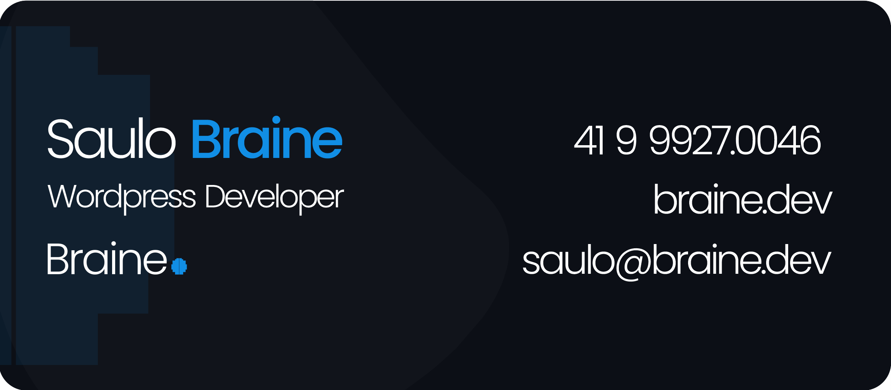

Contact/WhatsApp: [+55 (41) 9 9927.0046](https://wa.me/5541999270046)  
Single, Brazilian, 05/24/1996  
[saulo@braine.dev](mailto:saulo@braine.dev)  
[https://linkedin.com.br/in/saulobraine](https://linkedin.com.br/in/saulobraine)  
[https://braine.dev](https://braine.dev)

Version in 

### Objective

Front-end Development.

### Summary of Qualifications

- Professional with 7+ years of experience in WordPress/Elementor, primarily focused on institutional websites.
- Extensive experience in PHP, responsive design, and UX.
- Experienced in projects for the development and improvement of systems.
- Three years of experience in ReactJS.
- 36+ projects and counting.
- Advanced knowledge of Elementor builder.

### Education

- Bachelor's Degree in Multimedia Production
- Additional Course: Webmaster Training – UpInside.
- Additional Course: Go Stack ReactJS - Rocketseat

### Professional Experience

**Braine**  
FullStack/WordPress/ReactJS Freelancer Developer.  
September 2017 – Present.

- Analyzed and developed websites and systems.
- Developed e-commerce platforms using WooCommerce.
- Developed WordPress websites.
- Provided support and maintenance for websites.

**Apiki**  
ReactJS/WordPress Developer.  
May 2022 – September 2022 (freelancer).

- Developed WordPress sites using FSE technology (with ReactJS).
- Provided support and maintenance for websites.

**Be220**  
FullStack/WordPress Developer.  
September 2020 – 2022.

- Analyzed and developed websites and systems.
- Developed e-commerce platforms using WooCommerce.
- Developed WordPress websites.
- Provided support and maintenance for websites.

**Nabile IT**  
FullStack/WordPress Developer.  
February 2017 – 2020.

- Analyzed and developed websites and systems.
- Developed e-commerce platforms using WooCommerce.
- Developed WordPress websites.
- Provided support and maintenance for websites.

**BoaProcura.com**  
FullStack Developer.  
March 2015 – December 2016.

- Analyzed and developed websites and systems.
- Developed e-commerce platforms using WooCommerce and OpenCart.
- Developed WordPress websites.
- Provided support and maintenance for proprietary systems.
- Provided support and maintenance for websites.

**State Secretariat for Labor, Employment, and Solidarity Economy**  
IT Support.  
May 2014 – March 2015.

- Provided support and maintenance for desktops at Labor Agencies across the state.
- Managed inventory and supplies.

### Extracurricular Activities

- **UNIPACC** – Developed, maintained, and hosted a website for an NGO that supports children and adults with cancer.
